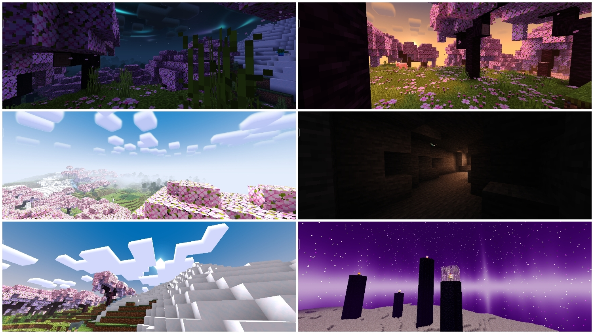

# Newb X Supplementary
Enhance your Minecraft experience with Newb X Supplementary, a cutting-edge bedrock shader meticulously designed to complement and amplify the intricate details of Newb X Legacy. Immerse yourself in a world where textures come alive, shadows dance with realism, and every pixel is infused with enhanced vibrancy. Elevate your gaming visuals to new heights with this dynamic duo, where Supplementary seamlessly supplements the details of Legacy, creating a truly immersive and visually stunning gameplay environment.

This shader is original from [Newb X Legacy](https://github.com/devendrn/newb-x-mcbe) and modified by [IndeedItzGab](https://github.com/IndeedItzGab).

## Screenshot

## Note
**RenderDragon Shaders are not officially supported on Minecraft**

## Downloads
### Android
- **64 Bits**
> 1. Install [Patched APK](https://github.com/DominoKorean/Render-dragon-shader-list/blob/main/patchedapp.md) in order to use the supported RenderDragon Shader.
> 2. Install [Newb X Supplementary V4.0 Pack](https://www.mediafire.com/file/rnjby3wf8zqa351/NewbXSupplementary-Android.mcpack/file) and Import it, after that activate it.
> 3. Restart your Minecraft to fix Cubemap (not necessary)
- **32 Bits**
> 1. Install our modified [Minecraft APK](https://www.mediafire.com/file/qvqyufqra2iy00h/Minecraft-Supplementary-V1-20-51.apk/file) that contains Newb X Supplementary materials in it.
> 2. Install [Additional-Resources Pack](https://www.mediafire.com/file/a9ame3s9bxpzis2/Additional-Resources.mcpack/file) to fix bugs and to add more features.
> 3. Import and activate it.

### iOS
> 1. Install our modified [Minecraft IPA](https://www.mediafire.com/file/5jhr9ib1z96k0xw/Minecraft-Supplementary-V1-20-51.ipa/file) that contains Newb X Supplementary materials in it.
> 2. Install [Additional-Resources Pack](https://www.mediafire.com/file/a9ame3s9bxpzis2/Additional-Resources.mcpack/file) to fix bugs and to add more features.
> 3. Import and activate it.

### Windows
> 1. Use [BetterRenderDragon](https://github.com/ddf8196/BetterRenderDragon) in order to use the supported RenderDragon Shader.
> 2. Install [Newb X Supplementary Pack](https://www.mediafire.com/file/ya9a8yrwcq7sl40/NewbXSupplementary-Windows.mcpack/file) and import it, after that activate it.

## QnA
## Patched APK is safe?
> Yes, it's safe it only has [MaterialBinLoader](https://github.com/ddf8196/MaterialBinLoader) injected in it, in order for you to use a RenderDragon Shader

### It's actually safe to use a modified APK/IPA?
> Actually no, modifying or using a cracked Minecraft is against the TOS of Mojang.

### Can we use the shader on the official Minecraft?
> No, currently Minecraft doesn't support Renderdragon Shader, you'll need a [MaterialBinLoader](https://github.com/ddf8196/MaterialBinLoader) injected in your APK in order to use them.
